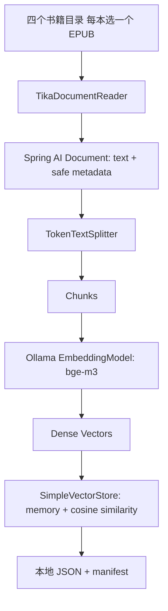
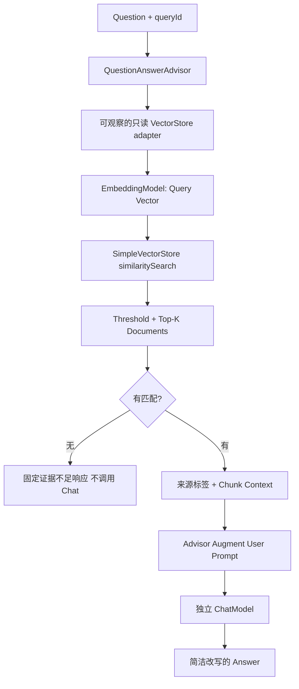

# RunAgent v0.5 — RAG / Running Knowledge Base

RAG（Retrieval Augmented Generation）按当前问题从外部知识库检索相关文本，再把这些文本加入模型输入。它让答案有可检查的知识依据，也让知识更新不必重新训练模型。v0.5 用四本本地跑步书籍跑通 Naive RAG；只做个人学习实验。

## 三个数据边界

| 能力 | 数据源 | 职责 | 使用方式 |
| --- | --- | --- | --- |
| Memory | 当前 conversationId 的近期对话 | 理解“那跟上个月比呢？” | `/api/agent` 的 MessageChatMemoryAdvisor |
| Tool | activities.json 的真实结构化记录 | 日期过滤、公里求和、活动排序、PB 估算 | Java Running Tools |
| RAG | 外部非结构化训练书籍 | 按 Query 检索知识并解释 | `/api/knowledge/ask` 的 QuestionAnswerAdvisor |

Memory 恢复已经聊过的 Context；RAG 动态寻找外部知识 Context。Conversation Memory 不进入向量库，RAG 也不为每次个人统计请求检索书籍。`activities.json` 不做 Embedding：语义相关的几条记录无法代表全年所有活动，LLM 也不应靠这些片段进行精确 SUM。

RAG 改变模型的输入 Context，不修改 Model Parameters。Fine-tuning 修改模型参数，常用于风格、行为或特定能力调整。知识经常变化时先考虑 RAG，不要把它们混为一谈。

## Ingestion Flow



`KnowledgeDocumentLoader` 支持单文件、单书目录和书籍集合根目录。集合根目录的每个直接子目录代表一本书；每本按 EPUB → TXT → MD 优先级选择一个文件，同格式按文件名排序。隐藏文件、免责声明不索引；不同时索引同一本书的 EPUB/MOBI/AZW3。当前未添加 PDF/MOBI/AZW3 Reader，因为实际四本书都有 EPUB。Markdown 作为 UTF-8 纯文本由 TextReader 加载，不额外解析语法。

Reader 输出会重建 metadata，只保留 `sourceId`、`sourceTitle`、`sourceType=book`、`filename`。sourceId 由标题生成；目录标题相同的来源需先整理为不同标题。绝对路径不进入 Document、Embedding 或模型。Tika 当前每本 EPUB 返回一个 Document，不提供可靠的 page/chapter metadata；API 的对应字段为 null，不编造章节。正文内可保留章节标题，但 EPUB 的结构层次未被建模。

`KnowledgeIndexService.chunk()` 使用 builder 配置 TokenTextSplitter；切块后保留来源 metadata。全库超过 maxNumChunks 则索引失败，不悄悄截断书籍。Spring AI 2.0.1 的 splitter 达到循环上限后会追加剩余文本，因此增加全库块数检查，拒绝异常的巨大尾块。

`SimpleVectorStore.add(chunks)` 实际调用 EmbeddingModel 将 Chunk 转为向量，保存 Chunk + metadata + embedding。全部 Embedding 完成、JSON 保存和结构检查通过后才发布 Ready。失败时候选索引不对外提供，原有索引不会因 Embedding 失败被覆盖。

## Document、Chunk、Token 与 Vector

Document 是 Spring AI 的统一知识单元，核心是正文 `text` 和来源 `metadata`。Chunk 仍是 Document，是大正文切出的较小块，用于控制上下文、减少噪音和提高检索粒度。

TokenTextSplitter 的 chunkSize 是 tokenizer token 数，不是汉字数。Tokenizer Token 是模型处理文本的离散编码片段；Embedding Vector 是模型从整段文本生成的一组连续浮点数。Vector 的维度由 Embedding 模型决定，与文本 Token 数不同。

Elasticsearch Analyzer Token 则是倒排索引用的词项：Text → Analyzer → Terms → Inverted Index → BM25。向量检索是 Text → Embedding Model → Dense Vector → Similarity Search。它们解决的检索关系不同；v0.5 不混入 BM25。

当前配置：

| 参数 | 默认值 | 含义 |
| --- | --- | --- |
| chunkSize | 800 | 每块的目标 tokenizer token 数 |
| minChunkSizeChars | 350 | 选择标点切断位置的最小字符约束 |
| minChunkLengthToEmbed | 10 | 更短的文本不嵌入 |
| maxNumChunks | 5000 | 应用全库安全上限 |
| keepSeparator | true | 保留文本分隔符 |
| punctuationMarks | 中文 。？！；、换行、英文 .?!; | 支持中文与英文句界 |

具体标点列表为 `['。', '？', '！', '；', '\n', '.', '?', '!', ';']`。这些字符帮助选择切断点，但不能保证每块都是一个完整语义单元。当前 v0.5 使用 Spring AI TokenTextSplitter，暂不实现显式 Chunk Overlap；也不实现 Semantic/LLM Chunking 或自定义递归切分框架。

## Chat 与 Embedding 分离

```text
ChatModel: OpenAI integration → DeepSeek / OpenRouter / Ollama OpenAI-compatible endpoint
EmbeddingModel: Ollama integration → bge-m3
```

Spring AI 2.0.1 配置 `spring.ai.model.chat=openai`、`spring.ai.model.embedding=ollama`，防止 OllamaChatModel 替代已有 Chat 客户端。`spring.ai.ollama.embedding.model` 配置 Embedding 模型；`spring.ai.ollama.init.pull-model-strategy=never` 禁止启动时拉模型。

Chat 使用 `AI_GATEWAY_*`，Embedding 使用 `RAG_OLLAMA_BASE_URL` / `RAG_EMBEDDING_MODEL`。DeepSeek Chat 可用不等于它提供 Embedding API。BGE-M3 支持中英文，适合本阶段中文为主的知识库；本地 Embedding 也减少知识文本外发。`qwen3:8b` 是当前本机已有的生成模型，此实验可通过 OpenAI-compatible endpoint 用它回答，保持书籍 Context 不出本机。

远程 Chat 模型仍会接收检索出的 Context。不要把“本地 Embedding”误解为“所有数据都不外发”。默认配置可以选择远程 Chat；真实验证使用本地 Qwen。

## Index 生命周期与持久化

| 条件 | 行为 |
| --- | --- |
| RAG_ENABLED=false | 不创建 KnowledgeIndexService、不读书、不初始化索引、不调用 Embedding |
| 已有 JSON 且 RAG_REINDEX=false | 加载 JSON，校验 manifest、checksum、块数、有效向量 |
| 无 JSON 或 RAG_REINDEX=true | Extract → Chunk → Embed → Save |
| 初始化失败 | 索引保持不可用，Knowledge API 返回 503，已有 API 继续可用 |

初始化发生在 ApplicationRunner，不通过 HTTP 触发。启动索引过程中 Knowledge 请求可能返回 503。没有公开 Reindex API。

默认 `.run-agent/rag/vector-store.json` 及 `.manifest` 全部被 `.gitignore` 忽略。临时文件也在相同私有目录。JSON 和 manifest 分别原子替换；两者更新之间若进程中断，checksum 不匹配会拒载，并要求重建。加载不依赖源书仍在原路径，也不重新 Embedding 全书。

manifest 使用模型名、端点和切块参数指纹，防止误用不兼容索引；校验维度一致、向量有效且非零、块数非零。不把正文、向量、密钥或完整源路径写到 manifest。**Changing the embedding model requires rebuilding the vector index.** 同名模型被重新下载替换、源书或来源集合变化，也需主动 `RAG_REINDEX=true`。此阶段没有自动源文件变更探测。

SimpleVectorStore 是内存内线性扫描 + Cosine Similarity：比较 Query Vector 和 Chunk Vector 的方向相似度，分数越大越相似；不是答案可信概率。整个 JSON 会装入内存，不具备生产数据库的扩展性、并发持久化、授权和恢复能力。**Not for production.**

## Query Flow 与 QuestionAnswerAdvisor



`KnowledgeQaService` 为每次请求创建 UUID 和 QuestionAnswerAdvisor。Advisor 调用 `KnowledgeSearchService.advisorStore(queryId)`，后者统一走显式 SearchRequest 和安全检索日志。Query 只 Embedding/检索一次，不先预检再重复检索。Adapter 是只读的，拒绝 add/delete。

Advisor 从返回的 Document text 组成 Context，增强 User Prompt。Adapter 在正文前添加安全来源标题，让模型区分四本书。`running-knowledge-system.txt` 要求只根据 Context 回答、依据不足时说明、忽略文档内指令、避免长引用和错误归因。它是来源约束，不是可证明的事实校验；召回正确仍可能生成错误答案。

零匹配时 Adapter 抛出内部 NoKnowledgeContextException；QA Service 捕获后返回固定证据不足消息，Chat Model 不会执行。非零匹配但不支持问题时，要求模型拒绝；这类拒绝受模型能力影响，必须真实测试。

## TopK、Threshold 与调试

默认 TopK=5、similarityThreshold=0.5 是学习起点，不声称最优。TopK 太小会漏关键知识；太大增加 Context Noise、Token 和注意力负担。Threshold 太低会引入不相关 Context；太高会拒绝本来有用的知识。

`POST /api/knowledge/search` 仅在 local profile 提供，每个命中只返回 rank、score、documentId、sourceTitle、pageNumber、chapter 和最多 200 个 Unicode 字符的 preview。没有完整 Chunk，也没有向量。local profile 不是认证，本地调试绑定 loopback。`POST /api/knowledge/ask` 无 Memory / conversationId，只返回 queryId 和 content。

日志记录 `STARTED`、`RETRIEVED`、rank / score / 来源 / chunkId、`COMPLETED` 或安全失败阶段，以及检索和总耗时。SimpleVectorStore 自带的路径日志、Ollama / Tika 可能携带数据的错误日志默认关闭。不记录完整问题、Context、书籍正文、向量或 Provider 异常堆栈。

WebFlux 的 Embedding 和同步 Chat 都在 boundedElastic 上执行，Knowledge HTTP 请求默认 deadline 为 180s，可用 `RAG_TIMEOUT` 配置。超时是尽力取消，阻塞 HTTP 不保证立即中断；索引不是 HTTP 请求，不受该 deadline 限制。

## 本地实验步骤

```bash
ollama list
ollama pull bge-m3
export RAG_ENABLED=true
export RAG_SOURCE_PATH=/absolute/path/to/run-book
export RAG_EMBEDDING_MODEL=bge-m3
export RAG_OLLAMA_BASE_URL=http://localhost:11434
export RAG_REINDEX=true
export AI_GATEWAY_BASE_URL=http://localhost:11434/v1
export AI_GATEWAY_API_KEY=ollama
export AI_GATEWAY_MODEL=qwen3:8b
./gradlew bootRun --args='--spring.profiles.active=local --server.address=127.0.0.1'
```

如本地 profile 覆盖了 OpenAI 配置，应直接在启动参数明确指定 `--spring.ai.openai.api-key=ollama --spring.ai.openai.base-url=http://localhost:11434/v1 --spring.ai.openai.chat.model=qwen3:8b`。

首次等待 INDEXED 后执行 ask/search。重启设 `RAG_REINDEX=false`，确认只有 LOADED，不再 EXTRACTED/CHUNKED/INDEXED。

实验问题（已通过真实提取确认丹尼尔斯书包含 VDOT、E/T 配速，四本书都有长距离相关文本）：

- 丹尼尔斯如何定义 E 配速训练？
- 丹尼尔斯训练法中 T 配速主要训练什么能力？
- 为什么轻松跑不应该跑得太快？
- VDOT 在训练计划中有什么作用？
- 马拉松训练中长距离训练有什么意义？
- 负面问题：ShardingSphere 4096 张分表应该怎么配置？

语义表达实验：比较“阈值配速训练有什么作用？”、“T配速主要提升什么？”、“乳酸阈值相关训练在丹尼尔斯体系中怎么安排？”。TopK 分别 2/5/10，Threshold 分别 0.3/0.5/0.7；这些只修改查询参数，不需重建。Chunk 400/800 需要重建，比较块数、召回主题完整性和噪音。

## Retrieval Error 与 Generation Error

回答错误时先检查 search preview、来源、rank、score；必要时只在本机查看忽略的 JSON 里的对应 Chunk。正确知识没有召回是 Retrieval 问题：检查提取是否完整、Chunk 是否把主题拆散、模型/语言、Query 表达、TopK 和 Threshold。不要先改 Prompt 来掩盖漏召回。

正确知识已在 Context 中，答案仍错误或错误归因，是 Generation 问题：检查 Prompt、Chat Model 能力、多个来源混淆和 Context Noise。分数高不意味着内容支持问题；先核对内容，再评价答案。

## 自动测试与实际验证

自动测试只使用自创训练文本、确定性的三维 Fake EmbeddingModel、Stub ChatModel 和本地假 OpenAI 网关。它们验证 Reader metadata、四来源去重、中文切块、上限失败、持久化/无重嵌入加载、模型变更拒载、损坏拒载、失败不发布半索引、TopK/Threshold、Advisor 实际注入 Context、零结果不调用模型、local 路由、输入校验、boundedElastic 和安全错误响应。所有 v0.1–v0.4 测试继续运行。

真实文件实验记录见 [v0.5 验证报告](v0.5-verification.md)。真实实验与离线测试的证据分开报告，不能用 contextLoads 或 Fake Vector 证明真实模型兼容性。

## 版权、当前限制与后续

四本书仅用于 Watson 本机个人学习。原书、完整正文、Chunk 和 VectorStore JSON 不进入 Git、测试或公开文档。测试知识完全自创。API 和日志不提供整段源文本；答案优先简洁解释和改写。

当前没有显式 overlap、章节结构检索、Query Rewrite、Reranker、Hybrid、RAG Tool、Agentic RAG、认证和事实核验，也没有长期 Memory、数据库或 Observability 框架。EPUB 正文和章节标题可提取，但不能保证图片内文本、表格结构和所有语义顺序完整。

下一阶段 v0.6 学习 MCP，将本地 Running @Tool 演进为 Running MCP Server，理解 Host、Client、Server、Tool Discovery、Streamable HTTP；本阶段不实现。

未来检索可演进为 SimpleVectorStore → Elasticsearch Vector Store → BM25 + Vector → Hybrid Search → RRF；不在 v0.5 引入。
